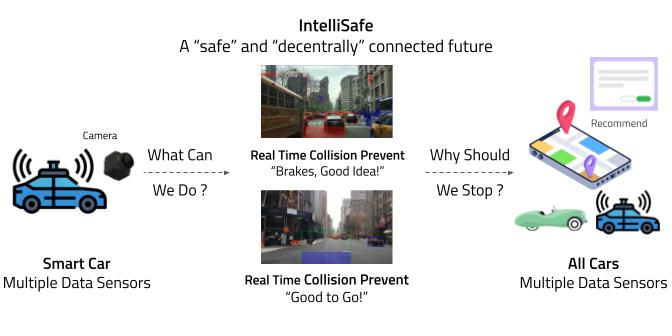

# IntelliSafe: A Safe and Decentrally Connected Future

IntelliSafe solution leverages sensor information from multiple modalities from the smart vehicle and provides driving assistance to its own drivers as well as others. The architecture diagram below highlights our solution in a qualitative sense, where we first obtain a stream from the eCAL to real time and all-weather collision prevention information. And, further we utilize the capabilities of this Pub/Sub architecture to connect other nearby vehicles to provide collision prone behavior related information from other vehicles.

  

<b>Figure 1:</b> IntelliSafe Conceptual Idea.

