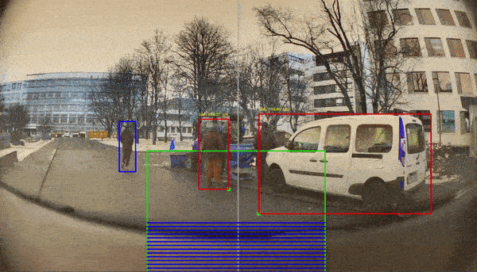

## IntelliSafe: A Safe and Decentrally Connected Future

IntelliSafe solution leverages sensor information from multiple modalities from the smart vehicle and provides driving assistance to its own drivers as well as others. The architecture diagram below highlights our solution in a qualitative sense, where we first obtain a stream from the eCAL to real time and all-weather collision prevention information. And, further we utilize the capabilities of this Pub/Sub architecture to connect other nearby vehicles to provide collision prone behavior related information from other vehicles.

  

    <b>IntelliSafe Conceptual Idea</b> 

## Our Implementation Architecture 

Here, we represent different exact components actually utilized by us for implementing our conceptual ideation. The diagram below highlights the our foundational pillers of keeping the driver "safe" via real time collision prevention alert insights and "decentrally" providing nearby unexpected break behavior information alerts as well.

  

   <b>IntelliSafe Architecture Diagram</b>

## Real Time Drive Assist System

In our proposed near real time solution we collect image and speed sensor data from the eCAL and make the road object detection on multiple objects like pedestrians, other cars etc. Further, we incorporate a brake application assist bar as well which raises alert whenever objects appear in front of the car. Additionally, we utilize the speed data from eCAL to dynamically increase the range of the break application area whenever speed increases as highlighted in the below recordings. Here, we observe that the region of brake application increases whenever the car attains higher speed. And, this can help our IntelliSafe tool to preemptively raise at further locations for the in trajectory objects.
 

  
  

    <b> Speed based increase on the driver assist detector</b>

## Proxity Based Decentralized Communication

With this idea, we intend to inform the nearby vehicles _(smart or not)_ that an incident has happened in the nearby vicinity and highlight the regions as well so that the user can select a new route.
We can use multiple approaches/protocols with this solution, but with eCAL's Pub/Sub based architecture we wanted to carry out a POC study for assessing the feasibility of this framework to handle parallelized topics from multiple publishers.
With our implementation of parallelized publishers for a single subscriber we observed that the subscriber alternatively can only receive topic information from a single publisher at a given instance.
It was done by using the _repeated_ type for the _Alert_ protobuf which stores data from multiple publishers but only accesses them sequentially during processing.
However, we argue that in highway settings or highly dense settings this strategy with limited nearby vehicles can have great efficiency to avoid owing to the relay message-like propagation behavior effect, refer diagram below.

  

   <b>IntelliSafe Multiple Publisher and Subscribers</b>

## Alert Notification Application

Based on the sequential inputs by multiple publishers, the subscriber with the help of a notifier application generates insightful panic break based alerts. And, as highlighted in the below diagram, we are also directed towards a screen that quantifies the vicinity of the collision when we click on "More Info".

  

   <b>IntelliSafe Alert Notification Application</b>

## Developer Instructions

We have three different modules that utilize eCAL's capabilities for near real time break assistance, decentralized alert notifier system, and a subscriber alert notification visualizer app.

1. `Near Real Time Break Assistance`: To execute this file we have to make sure that all the dependencies for the object detection module and eCAL are already installed. Then we have to execute the `intellisafe_main.py` with eCAL data being streamed parallely. It incorporates the object detection into a singular module and it also provides a near real time stream of the eCAL data. We also get annotated object outputs with distance and speed estimates to provide break assistance information which dynamically depends on the car speed as well.

**Note:** The AI detection pipeline as a separate execution module exists in `object_detection` module. It inputs video data and the corresponding execution details for a separate analysis are present in its [README.md](object_detection/README.md) file.

2. `Decentralized Alert Notifier System`: The `intellisafe_main.py` needs to be executed parallely beforehand and then we execute the `intellisafe_main_fork.py` to demonstrate Pub/Sub communication between two smart cars. And, then we have the `AlertNotification.py` subscriber which represents a regular car without any smart components that receives the panic break alerts from these two nearby smart cars.

3. `Subscriber Alert Notification Visualizer App`: In order to see the application for alert notification we need to execute the `AlertNotification.py`. When the panic braking is observed with a close proximity of a vehicle the Alert Notification UI is triggered.

